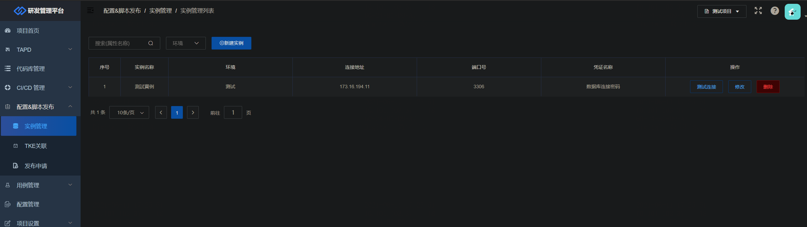
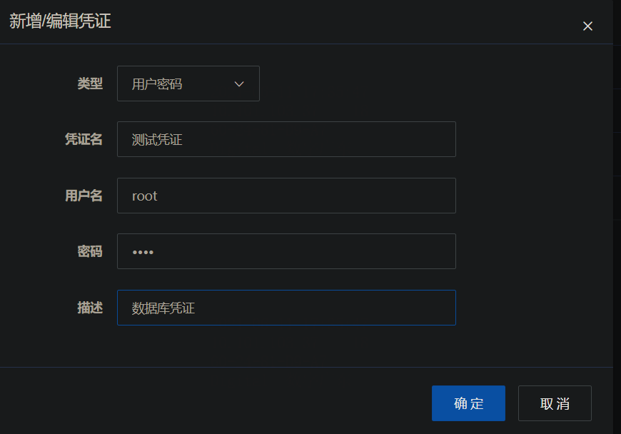
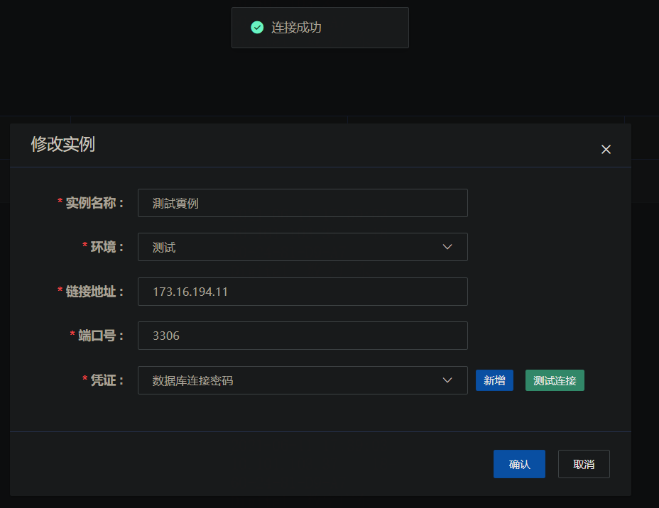
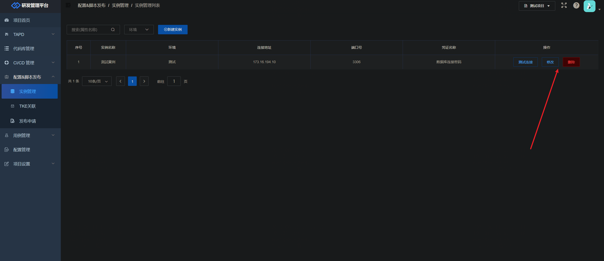
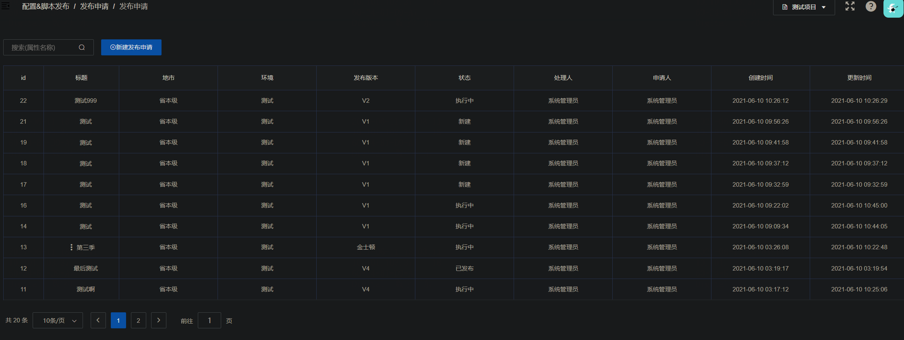
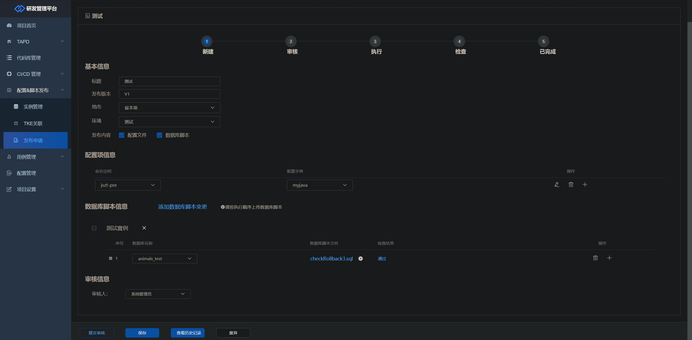
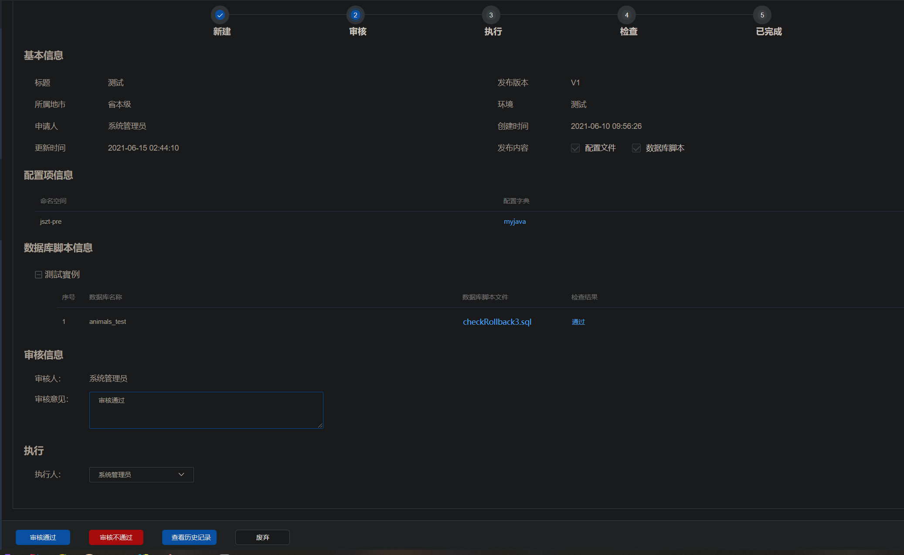
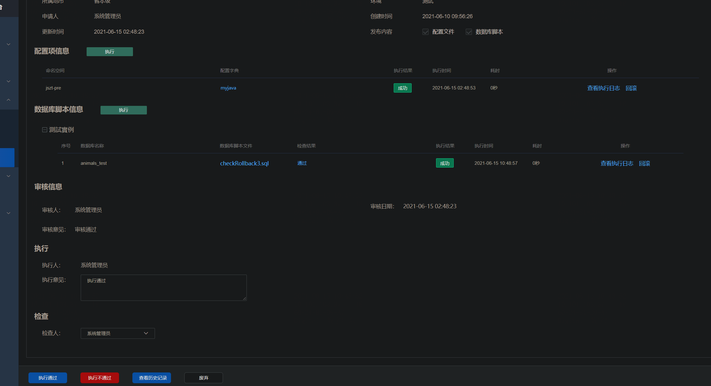
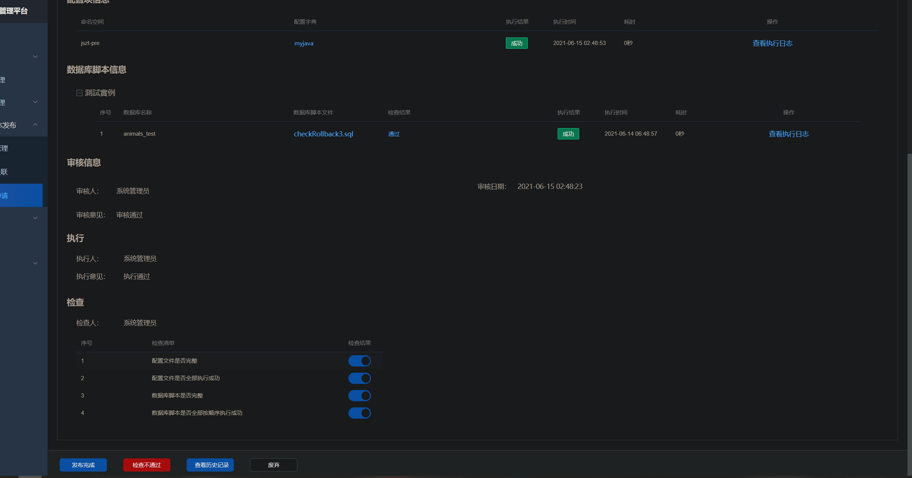

# 发布申请使用文档-脚本部分

## 实例管理

实例管理用于绑定数据库实例，数据库实例指的是一个数据库连接，它包含数据库`IP`，数据库端口，数据库账号密码，这4个基本信息组成一个数据库实例。

用户在实例管理菜单可以对实例进行管理，实例列表列出了当前用户创建的所有实例，当前登录用户只能看见自己创建的实例，不能看见其他用户创建的实例。

### 新建实例

新建实例需要填写实例名称、环境、数据库链接地址、端口号和选择凭证。凭证是一个数据库的账号密码，用户可以新增凭证，也可以选择现有的凭证。

新增凭证是选择用户密码类型，输入数据库的账号、密码和其他描述性信息，新增实例时选择相应的数据库凭证即可。

用户输入数据库实例信息信息时，可以点击测试按钮测试数据库连接是否成功。数据库地址和研发管理平台网络需要打通，不然会连接失败。

### 修改和删除实例

用户之前创建的实例支持修改和删除，用户可以点击实例列表的修改或者删除按钮进行操作。

## 发布申请

### 发布申请单列表

发布申请单列出当前项目的所有申请单，其中处理人指的是当前单据节点的处理人。用户可以点击新建发布申请按钮打开一个新建发布申请单据进行编辑。

### 单据新建

用户新建单据时，需要填上单据的基本信息，并上传数据库脚本文件。

上传文件时需要选择文件所属数据库实例，上传成功后选择数据库名称就会自动执行数据库脚本检查，检查的详细结果可通过点击列表的检查结果查看。

新建单据的信息填完并且检查结果通过后，可以选择直接提交审核或者暂时保存，提交审核单据会流转到审核节点。

### 单据审核

单据流转到审核节点时，审核人需要填写审核意见和执行人，然后根据审核的内容决定是将单据审核通过还是审核不通过。审核通过单据会流转到执行节点，审核不通过单据会被打回到新建节点。

### 单据执行

单据流转到执行节点时，用户需要执行单据的内容，点击相应的执行按钮即可。执行会返回相应的执行结果，可通过查看执行日志查看详细内容。用户对执行结果不满意，可以点击回滚按钮回滚已执行内容，执行失败也可以重新执行，排除因网络问题出现的执行失败情况。

用户在执行成功后填写完执行意见和下一步的检查人可以点击执行通过，单据会流转到下一个检查节点；同时如果单据执行有问题，用户点击执行不通过，单据会打回到新建节点，同时将已执行的内容回滚。

### 单据检查

单据流转到检查节点时，检查人需要根据实际检查结果选择勾选检查内容是否通过。当4个检查内容都通过时，用户才可以点击发布完成按钮，单据流转到已发布状态，整个单据流程结束。当单据检查不通过时，用户点击检查不通过按钮，单据被打回到执行中状态，同时将已执行的内容回滚。

